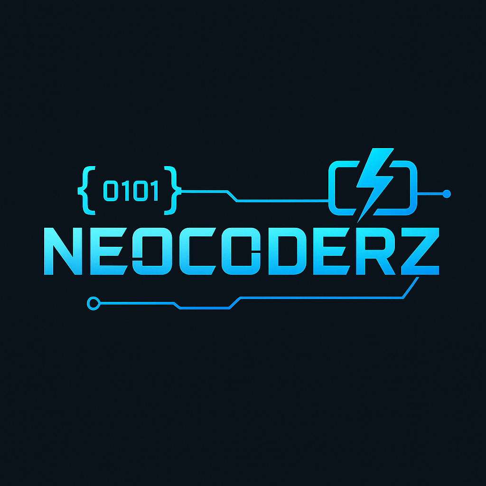
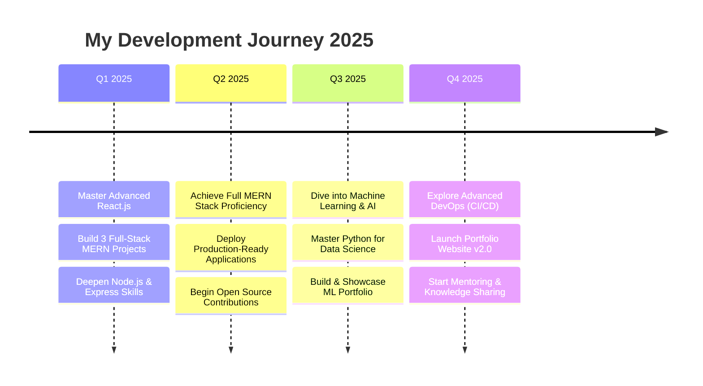

<div align="center">
  
  
  # ⚡ NeoCoderZ-25
  
  
  
  <br/>
  
  
  [](https://github.com/NeoCoderZ-25)
  [](https://github.com/NeoCoderZ-25)
</div>

---

## 🚀 About Me

> *"Code is poetry written in logic"*

Hey there! I'm **NeoCoderZ**, a developer passionate about building innovative solutions through clean, efficient code. I'm on an exciting journey to master full-stack development while exploring the fascinating world of Machine Learning and AI.

- 🌱 **Currently Learning:** Advanced React patterns, Node.js, and Python ML frameworks (Scikit-learn, Pandas)
- 🔭 **Working On:** Building full-stack MERN applications and practical ML models
- 📱 **Unique Setup:** I develop entirely on Android using SPCK Editor + Termux, turning limitations into strengths
- 🎯 **My Goal:** To contribute meaningfully to open-source and build applications that make a difference
- ⚡ **Fun Fact:** I turn coffee into code and bugs into features!

---

## 🛠️ Tech Arsenal

### **Languages & Frameworks**
<p align="center">
  
</p>

### **Development Environment**
```
🖥️   Platform: Android Development Setup
📱   IDE: SPCK Editor (Primary)
⌨️    Terminal: Termux CLI
🔄   Version Control: GitHub Mobile + Git CLI
☁️    Deployment: Vercel, Replit, GitHub Pages
🎨   Design: Figma, CSS Grid/Flexbox
```

### **Current Tech Stack**
<div align="center">

| Frontend | Backend | Database | Tools |
|----------|---------|----------|-------|
| HTML5, CSS3 | Node.js (Learning) | MongoDB | Git, GitHub |
| JavaScript ES6+ | Express.js (WIP) | JSON | SPCK Editor |
| React.js | Python | LocalStorage | Termux |

</div>

---

## 📊 GitHub Analytics

<div align="center">
  
  
</div>

<div align="center">
  
</div>

---

## 🏆 Achievement Showcase

<div align="center">
  
</div>

---

## 🌟 Featured Projects

<div align="center">

| 🚀 Project | 📝 Description | 🛠️ Tech Stack | 🔗 Links |
|------------|----------------|----------------|----------|
| **🌤️ NeoWeather** | A sleek, real-time weather app with location-based forecasts and a beautiful, responsive UI | JavaScript, CSS3, Weather API | [Live Demo](#) |
| **🎨 CodeSparks** | A modern toolkit and component library to help developers build responsive designs faster | HTML5, CSS3, JavaScript | [Live Demo](#) |
| **🤖 PyML-Starter** | A collection of beginner-friendly ML templates and tutorials to kickstart a journey in data science | Python, NumPy, Pandas | [Code](#) |
| **📱 MobileDevHub** | A curated set of resources and tools designed for and by mobile-first developers | React, CSS Grid, PWA | [Live Demo](#) |

</div>

> **Note:** Some project links are placeholders. Feel free to explore my repositories for the latest updates!

---

## 📈 Development Activity

<!--START_SECTION:activity-->
- 🔥 **Current Streak:** 25 days of consistent coding
- ⭐ **Total Stars Earned:** 50+
- 🍴 **Repositories Forked:** 15+
- 📦 **Total Repositories:** 20+
- 💻 **Lines of Code:** 10,000+ (and counting!)
<!--END_SECTION:activity-->

---

## 🎯 2025 Roadmap

<div align="center">



</div>

### **Current Focus Areas:**
- 🔧 **Backend Development:** Mastering Node.js and Express.js for robust server-side applications
- 🗄️ **Database Management:** Advanced MongoDB patterns and data optimization techniques
- 🤖 **Machine Learning:** Building practical ML models with Python (Scikit-learn, Pandas, NumPy)
- 🚀 **DevOps Integration:** Learning CI/CD pipelines and modern deployment strategies

---

## 📱 Mobile-First Development Philosophy

> *"Why develop on Android? Because innovation shouldn't be limited by your hardware."*

My entire development workflow runs on Android, powered by:

- **📱 SPCK Editor:** For a fluid, mobile-native coding experience with syntax highlighting and project management
- **⌨️ Termux:** For a powerful Linux-like terminal environment and Git command line operations
- **📚 GitHub Mobile:** For on-the-go repository management, code reviews, and collaboration

This unique setup challenges me to be better, fostering:

- ✅ **Resource Optimization:** Writing lean and efficient code is a necessity, not an option
- ✅ **Creative Problem-Solving:** Thriving within constraints builds resilience and innovation
- ✅ **True Mobile-First Design:** Building for mobile because I live and breathe mobile development
- ✅ **Deeper Tool Appreciation:** Understanding the core mechanics of development tools and workflows

---

## 🎨 Design & Code Philosophy

```css
.my-code-style {
  approach: "clean-and-modular";
  architecture: "component-driven";
  documentation: "clear-and-concise";
  testing: "test-driven-development";
  performance: "optimized-by-default";
  accessibility: "built-in-and-inclusive";
  maintainability: "future-proof";
}
```

### **Core Principles:**
- 🧩 **Modular Design:** Breaking complex problems into smaller, reusable components
- 📚 **Self-Documenting Code:** Writing code that tells a story and explains itself
- ⚡ **Performance First:** Optimizing for speed and efficiency from the ground up
- ♿ **Accessibility Matters:** Building inclusive experiences for all users
- 🔄 **Continuous Learning:** Staying updated with the latest trends and best practices

---

## 🌐 Let's Connect

<div align="center">
  
[](https://github.com/NeoCoderZ-25)
[](mailto:neocoder2511@gmail.com)
[](https://www.youtube.com/@NeoCoderZ-25)
[](#)
[](#)

</div>

### 💬 **I'm open to:**
- 🤝 **Collaboration** on interesting full-stack or ML projects
- 💡 **Knowledge Sharing** and learning from the amazing developer community
- 🚀 **Open Source contributions** that make a positive impact
- 📝 **Technical Writing** about my unique mobile development journey
- 🎤 **Speaking opportunities** about mobile-first development workflows

---

## 💡 Random Dev Quote

<div align="center">
  
</div>

---

## 📊 Weekly Development Breakdown

<!--START_SECTION:waka-->
```text
JavaScript   12h 30m  ████████████░░░░░░░░░░░░░   45.2%
Python       8h 15m   ███████████░░░░░░░░░░░░░░   29.8%
CSS          4h 20m   ████░░░░░░░░░░░░░░░░░░░░░   15.7%
HTML         2h 35m   ███░░░░░░░░░░░░░░░░░░░░░░   9.3%
Other        45m      █░░░░░░░░░░░░░░░░░░░░░░░░   2.8%
```
<!--END_SECTION:waka-->

---

## 🎉 Fun Section

<details>
<summary>🎲 Click here for some fun facts about my coding journey!</summary>

### **Coding Stats That Make Me Smile:**
- ☕ **Cups of coffee consumed while coding:** 500+ (and counting!)
- 🐛 **Bugs fixed:** More than I'd like to admit, but each one taught me something new
- 🌙 **Late-night coding sessions:** Too many to count, but they're the most productive!
- 🎵 **Favorite coding playlist:** Lo-fi hip hop beats to code/relax to
- 🏆 **First successful deployment:** Still gives me goosebumps when I think about it
- 📱 **Apps installed on my Android dev setup:** 50+ development-related tools

### **My Coding Mantras:**
- *"There's no such thing as perfect code, only better code"*
- *"Every bug is a learning opportunity in disguise"*
- *"Mobile-first isn't just a design principle, it's a mindset"*
- *"The best time to plant a tree was 20 years ago. The second best time is now."*

</details>

---

<div align="center">
  
  
  ### ⭐ If you find my work interesting, consider giving it a star!
  
  *"Every expert was once a beginner. Every pro was once an amateur. Every icon was once an unknown."*
  
  **Happy Coding! 🚀**
</div>