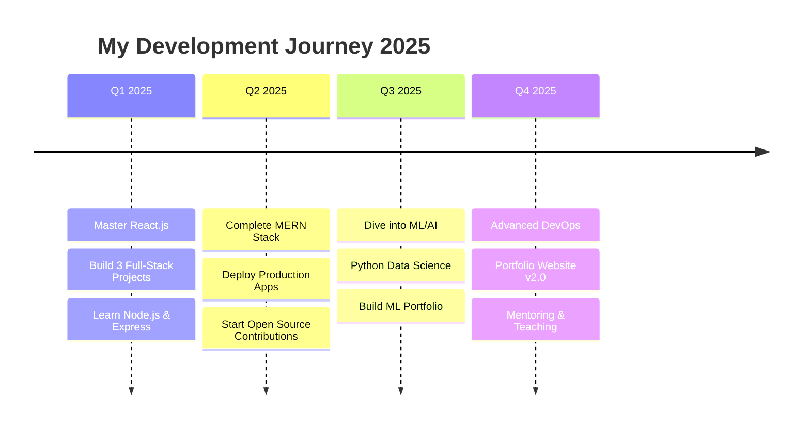

<div align="center">
  
  
  # ⚡ NeoCoderZ-25
  
  
  
  
  [](https://github.com/NeoCoderZ-25)
  [](https://github.com/NeoCoderZ-25)
</div>

---

## 🚀 About Me

> *"Code is poetry written in logic"*

Hey there! I'm **NeoCoderZ**, a passionate developer who believes in building innovative solutions through clean, efficient code. Currently on an exciting journey to master full-stack development while exploring the fascinating world of Machine Learning.

- 🌱 **Currently Learning:** Advanced React patterns, Node.js backends, and Python ML frameworks
- 🔭 **Working On:** Full-stack MERN applications and ML projects
- 📱 **Unique Setup:** Developing entirely on Android using SPCK Editor + Termux
- 🎯 **Goal:** Contributing to open-source projects and building impactful applications
- ⚡ **Fun Fact:** I turn coffee into code and bugs into features!

---

## 🛠️ Tech Arsenal

### **Languages & Frameworks**
<p align="center">
  
</p>

### **Development Environment**
```
🖥️  Platform: Android Development Setup
📱  IDE: SPCK Editor (Primary)
⌨️   Terminal: Termux CLI
🔄  Version Control: GitHub Mobile + Git CLI
☁️   Deployment: Replit, Vercel, GitHub Pages
🎨  Design: Figma, CSS Grid/Flexbox
```

### **Current Tech Stack**
| Frontend | Backend | Database | Tools |
|----------|---------|----------|-------|
| HTML5, CSS3 | Node.js (Learning) | MongoDB | Git, GitHub |
| JavaScript ES6+ | Express.js (WIP) | JSON | SPCK Editor |
| React.js | Python | LocalStorage | Termux |

---

## 📊 GitHub Analytics

<div align="center">
  
  
</div>

<div align="center">
  
</div>

---

## 🏆 Achievement Showcase

<div align="center">
  
</div>

---

## 🌟 Featured Projects

<div align="center">

| 🚀 Project | 📝 Description | 🛠️ Tech Stack | 🔗 Links |
|------------|----------------|----------------|----------|
| **🌤️ NeoWeather** | Real-time weather application with beautiful UI and location-based forecasts | JavaScript, CSS3, Weather API | [Live Demo](#) \| [Code](#) |
| **🎨 CodeSparks** | Modern responsive design toolkit and component library for developers | HTML5, CSS3, JavaScript | [Live Demo](#) \| [Code](#) |
| **🤖 PyML-Starter** | Beginner-friendly machine learning project templates and tutorials | Python, NumPy, Pandas | [Live Demo](#) \| [Code](#) |
| **📱 MobileDevHub** | Resource collection and tools for mobile-first development | React, CSS Grid, PWA | [Live Demo](#) \| [Code](#) |

</div>

---

## 📈 Development Activity

<!--START_SECTION:activity-->
```text
🔥 Streak: 25 days of coding
⭐ Total Stars Earned: 50+
🍴 Total Forks: 15+
📦 Total Repositories: 20+
```
<!--END_SECTION:activity-->

---

## 🎯 2025 Roadmap

<div align="center">



</div>

### **Current Focus Areas:**
- 🔧 **Backend Development:** Mastering Node.js and Express.js
- 🗄️ **Database Design:** Advanced MongoDB patterns and optimization
- 🤖 **Machine Learning:** Python libraries (NumPy, Pandas, Scikit-learn)
- 🚀 **DevOps:** CI/CD pipelines and deployment strategies

---

## 📱 Mobile-First Development

> **Why Android Development?** Because innovation shouldn't be limited by hardware!

I've chosen to develop entirely on Android using:
- **SPCK Editor**: For code editing and project management
- **Termux**: For CLI operations and Git workflows
- **GitHub Mobile**: For repository management and code reviews

This unique setup has taught me:
- ✅ Resource optimization and efficient coding
- ✅ Mobile-first responsive design principles
- ✅ Creative problem-solving within constraints
- ✅ Appreciation for developer tools and workflows

---

## 🎨 Design Philosophy

```css
.my-code-style {
  approach: "clean-and-modular";
  architecture: "component-based";
  documentation: "comprehensive";
  testing: "test-driven-development";
  performance: "optimized-first";
  accessibility: "inclusive-design";
}
```

---

## 🌐 Let's Connect

<div align="center">
  
[](https://github.com/NeoCoderZ-25)
[](mailto:neocoder2511@gmail.com)
[](https://www.youtube.com/@NeoCoderZ-25)
[](#)
[](#)

### 💬 Open to:
- 🤝 **Collaboration** on interesting projects
- 💡 **Mentorship** and knowledge sharing
- 🚀 **Open Source** contributions
- 📝 **Technical Writing** and tutorials

</div>

---

## 💡 Random Dev Quote

<div align="center">
  
</div>

---

## 📊 Weekly Development Breakdown

<!--START_SECTION:waka-->
```text
JavaScript   12 hrs 30 mins  ████████████░░░░░░░░░░░░░   45.2%
Python       8 hrs 15 mins   ███████████░░░░░░░░░░░░░░   29.8%
CSS          4 hrs 20 mins   ████░░░░░░░░░░░░░░░░░░░░░   15.7%
HTML         2 hrs 35 mins   ███░░░░░░░░░░░░░░░░░░░░░░   9.3%
```
<!--END_SECTION:waka-->

---

<div align="center">
  
  
  ### ⭐ If you find my work interesting, consider giving it a star!
  
  *"Every expert was once a beginner. Every pro was once an amateur. Every icon was once an unknown."*
</div>